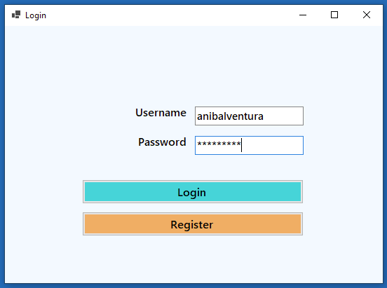
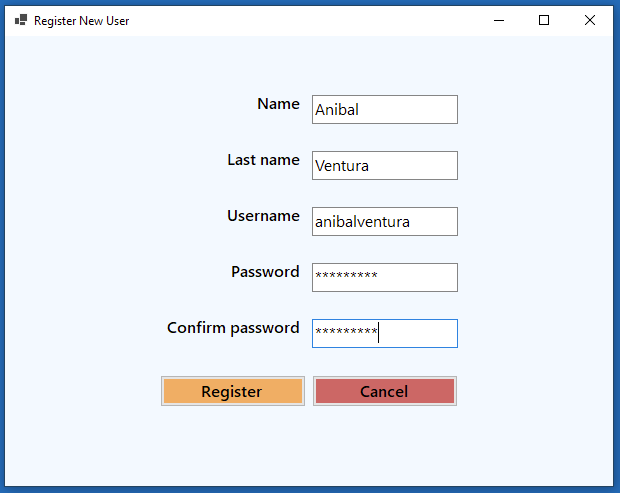
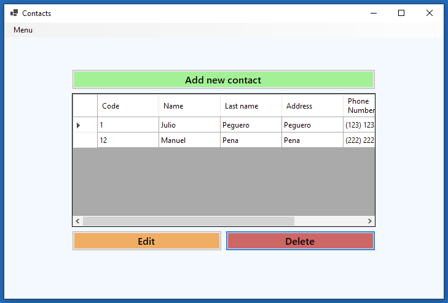
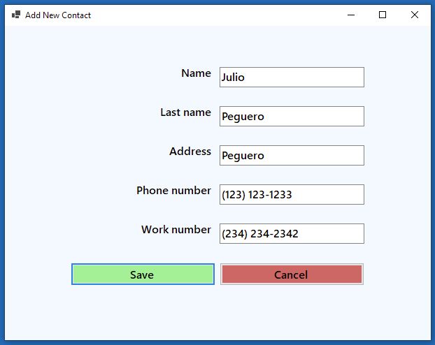

# Contacts Agenda

[](https://dotnet.microsoft.com)
[](https://dotnet.microsoft.com)
[](LICENCE.md)

<p align="center">
  
  
  
  
</p>

WinForm app to manage a contacts agenda by user, written in .NET with SQL-Server using OOP.

## Features

- Data persistence with SQL Server.
- Login with username and password.
  - Verify in the database if the data entered is correct.
- Create new users to login.
  - Check if username exists.
  - Check if passwords match.
  - Check if all the data has been completed.
- Shows contact list only of the user who created it.
- Create, edit and delete contacts.
  - Check if all the data has been completed.
- Option in menu strip to logout.

## Dependencies

- [System.Data.SqlClient - Version 4.8.3](https://www.nuget.org/packages/System.Data.SqlClient)

## Build

1. Create a SQL Server database with the following tables:

- Users
  - **Id** as primary key and autoincrement.

| Column Name | Data Type    | Allow Nulls |
| ----------- | ------------ | ----------- |
| Id          | int          | [ ]         |
| Name        | nvarchar(50) | [ x ]       |
| LastName    | nvarchar(50) | [ x ]       |
| Username    | nvarchar(50) | [ x ]       |
| Password    | nvarchar(50) | [ x ]       |

- Contacts
  - **Id** as primary key and autoincrement.
  - **IdUser** as foreign key from table **Users**.

| Column Name | Data Type     | Allow Nulls |
| ----------- | ------------- | ----------- |
| Id          | int           | [ ]         |
| Name        | nvarchar(50)  | [ x ]       |
| LastName    | nvarchar(50)  | [ x ]       |
| Address     | nvarchar(100) | [ x ]       |
| PhoneNumber | nchar(30)     | [ x ]       |
| WorkNumber  | nchar(30)     | [ x ]       |
| IdUser      | int           | [ x ]       |

2. In ../ContactAgenda/App.config file change line seven for:

```xml
connectionString="data source=<SQL SERVER NAME>;initial catalog=<DATABASE NAME>;integrated security=True;"
```

## License

```xml
MIT License

Copyright (c) 2021 Anibal Ventura
```
